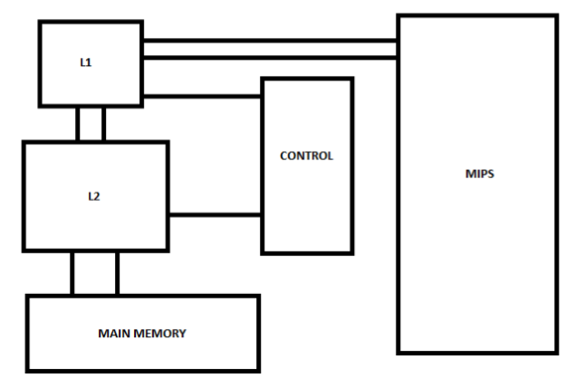

# VHDLMipsCache
This repository contains the VHDL files describing a mips processor with two levels of cache implementing both write-through and write-back.

Hardware simulation softwares are, normally, paid. This <a href="https://en.wikipedia.org/wiki/List_of_HDL_simulators">link</a> contains a list of existing simulators and some open source ones. For this project, I used the available license for the Modelsim VHDL Simulator in my University PUCRS.

This work contains the VHDL files discribing the complete MIPS processor interfacing an external memory module with the addition of two cache levels and the writing control. 

The following image roughly describes the project:

